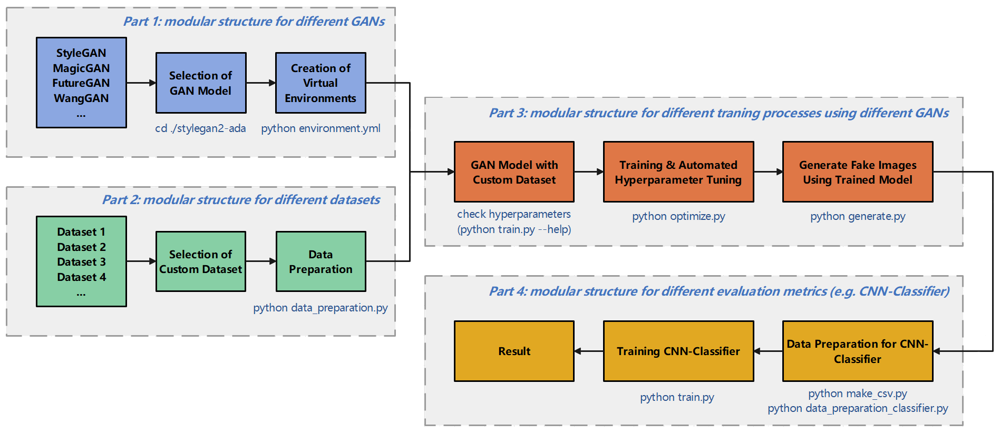
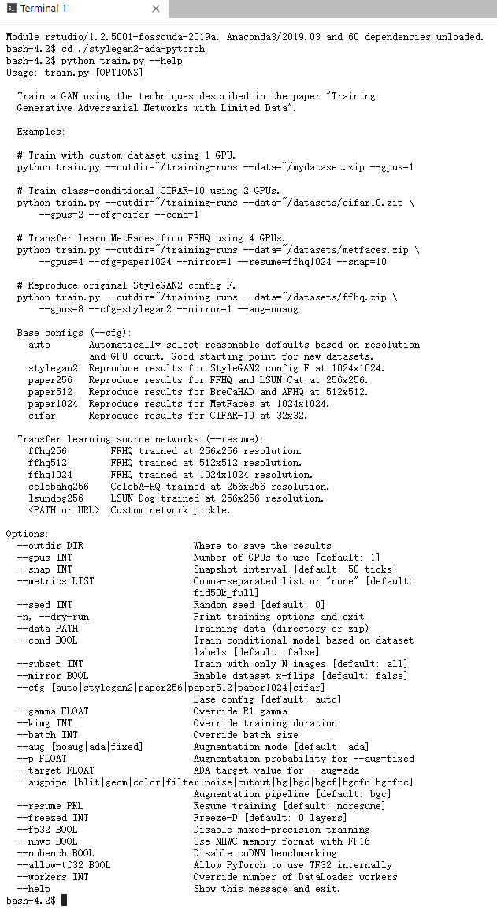
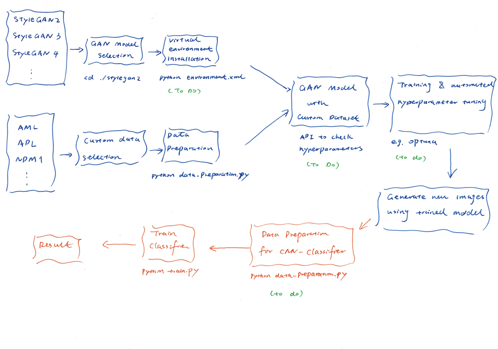

# Software Framework for Image Data Synthesizing based on GAN for ML-Systems in Digital Health

## Aim

On the one hand, **lack of data** is a common problem in the field of Digital Health, on the other hand, medical imaging always require **high definition** images. The aim of this framework is **generalizing the process** to make new images using medical images with GAN and **make this framework easily to be configurated** for different use cases with different custom datasets and different GANs.

## Structure of the framework

As shown in this picture, this framework consists of 4 parts, each part is a modular structure, it can be easily changed or modified for different use cases. 



### Part 1:

With part 1 it is easily to **choose different GANs** and **create proper environments** so that this GAN can work smoothly. 

Exact Python library dependencies are stored in `environment.yml`. You can use the following commands with Miniconda3 to create and activate the proper Python environment:

```python
* conda env create -f environment.yml
* conda activate xxx 
# xxx is the name of this virtual environment, you can find it in the first line of `environment.yml`)
```

**!** If you are using HPC (High Performance Computing), the environment and packages depend heavily on the module, software etc. installed on the system, you need to check it. If the system don't have some packages, e.g. with the error "ResolvePackageNotFound" just delete those dependencies in this file and install them per pip or conda manually.

### Part 2:

With part 2 it is easily to use `data_preparation.py` to **prepare custom dataset** for training the GAN.

### Part 3:

With part 3 you can use a specific GAN model. You need to first check which **hyperparameters** are needed, then start training. This part provides an **automated hyperparameter tuning** function. After training you can choose the best model to **generate new images**.

#### Check hyperparameters

It is very import for all Deep Learning models to understand what kind of hyperparameter this model need!

Use the following command to check the hyperparameters

`python train.py --help`

For instance, if you want to check the hyperparameters of StyleGAN2-ADA, after you directed to its directory and run the command before, you see all the hyperparameters with some examples. Read carefully this document.



#### Automatic hyperparameter optimization during training

`Optimize.py` uses Optuna and MLflow to realize automatic hyperparameter optimization.

- Optuna: 
  - An automatic hyperparameter optimization software framework, particularly designed for machine learning.
  - [Optuna - A hyperparameter optimization framework](https://optuna.org/)
- MLflow: 
  - An open source platform to manage the ML lifecycle, including experimentation, reproducibility, deployment, and a central model registry.
  - [MLflow - A platform for the machine learning lifecycle](https://mlflow.org/)

You need to give some important parameters to let the training begin, e.g. `python optimize.py --data=../data/wsi_npm1_1024x1024.zip --outdir=./outdir --resume=ffhq1024 --gpus=4`.

- `--data`: data for training
- `--outdir`: directory to store output 
- `--resume`: the pretrained model used for transfer learning (it is always recommended to use transfer learning!)
- `--gpus`: number of GPUs used for training

You can control the total length of training (measured in thousands of real images) using `--kimg`, for instance, `python optimize.py --kimg=1000`.

#### Total training time

The total training time depends heavily on resolution, number of GPUs, dataset, desired quality, and hyperparameters. 

For example for StyleGAN2-ADA:

- You can find the **expected training time** here [NVlabs/stylegan2-ada-pytorch: StyleGAN2-ADA - Official PyTorch implementation](https://github.com/NVlabs/stylegan2-ada-pytorch)

* In typical cases, 25000 kimg or more is needed to reach convergence, but the results are already quite reasonable around 5000 kimg. 1000 kimg is often enough for transfer learning, which tends to converge significantly faster. 

### Part 4:

After new images are generated, you can **couple a CNN Classifier** or other tools / systems to check whether these generated image are "true enough".

`data_preparation_classifier.py` is helpful to prepare your real and generated data for CNN Classifier.

---

Basic idea is, you have different repositories of different GAN models, if you have chosen one GAN model, you can enter this model's repository and use this GAN model directly. 

In part 1 and part 3, because the environment `environment.xml`, hyperparameters which are used `show_hyperparameters.py`, how to train, automatically hyperparameter optimize `optimize.py` and generate `generate.py` depend on the model, for each model  there are those 4 files in their repositories.

In part 2, because it is faster to read one file than read many files in a directory, modern models can read a `.zip` file as input, the `data_preparation.py` provides a general approach to transfer images to a `.zip` file, and the image sizes can be changed with this script. 

In part 4, this part can be seen as a whole part, different tools / methods can be coupled to here, for my purpose, a CNN Classifier is coupled after GAN, so that mixed (real or generated) images after data preparation with`data_preparation_classifier.py` can be sent to the CNN Classifier to check the result.  

## To-dos

According to the plan, to finish the pipeline there are 4 To-dos which need to be done.

- [x] A script `environment.yml` which saves the environment this model uses and after running this script a virtual environment will be created so the model can run smoothly in this virtual environment.
  - done on 2021.11.08

- [x] A script `hyperparameters.py` which stores information of all the hyperparameters, after running this script, people will know what kind of hyperparameters they should type in and what are the meanings of these hyperparameters.
  - done on 2021.11.08
- [x] A script `optimize.py` which can run training and hyperparameter optimization automatically using some tools for instance [Optuna](https://optuna.org/) or [NNI](https://nni.readthedocs.io/en/stable/).
  - done on 2021.11.05
- [x] A script `data_preparation_classifier.py` which prepares data for the CNN classifier, e.g. the script can realize how many % real data and how many % generated data will be used for the Classifier.
  - done on 2021.11.12
  